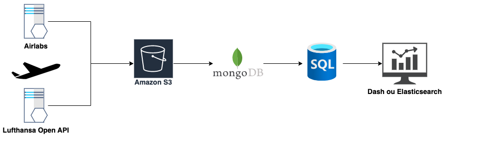
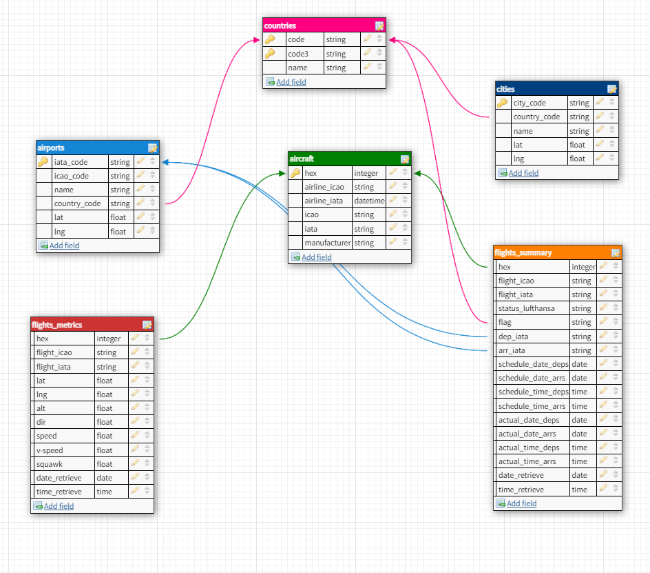

# Lufthansa Flight Tracker 

### Context
Creation of a flight tracker as part of the datascientest training project (dataengineer bootcamp training by datascientest, june 2022)
Team : Houda EL-MMI, Yacine AMESROUY & Alban DAVID

## Summary
#### I - Flight tracker app overview
#### II - Data and API
#### III - Data organization
##### a. General organization and justification
##### b. SQL modelization
##### c. data cleaning
#### IV - Flight tracker app
##### a. Creating the app with dash and plotly
##### b. Runing the app with docker
##### c. Unit testing
#### V - Automatisation and CI/CD
##### a. Airflow
##### b. CI/CD
#### VI - Improvement / to do

## I - Flight tracker app overview

## II - Data and API
We collected our data with two API:
- Lufthansa API
- Airlabs API
# ARGUMENTER POURQUOI ON A PRIS DEUX API ET RESUMER LES DONEES RECOLTEES (airports, + le fait qu'il y ait statique et temps réel etc.) YACINE ?

## III - Data organization
### a. General organization

As we can see on this schema, there are several steps :
1) Collecting data with Airlibas and Lufthansa API
2) All of these raw data are stored in a amazon cloud bucket (S3)
- Why ? It'ss like a datalake and allow us to keep our raw data in a common place.
3) After, these data are transferred to a nosql mongodb database (stored on a cloud platform)
- Why ? The raw data are in a json format. It's an easily usable format on mongo db. Once the data are on mongo db, we can easily transform them into a pandas dataframe to clean our data.
4) Once data are cleaned, we inject them into an sql database (cloud mysql with aws rds)
- Why ? Regular update of real times flight informations are like transactions. We needed constraints and a strict schema. This allows that the final informations on the dashboard are always consistent. Futhermore, the SQL modelisation were challenging and led us to understand deeply the data and what we want to do with it in the end use.
5) We use an API to display our data (Dash and plotly)

Note : All the data are stored on the cloud.

### b. SQL modelization
There is our sql shema modelization :

### c. data cleaning
# EXPLIQUER LE NETTOYAGE DES DONNEES + MISE EN GARDE : Data not available yet et heure 01:01 lorsque c'est le cas. Yacine ?

## IV - Flight tracker app
### a. Creating the app with dash and plotly
Detailed information can be found [here](src/dst_dashboard/README.md)

### b. Runing the app with docker
Detailed information can be found [here](src/dst_dashboard_dokcer/README.md)

### c. Unit testing
We did unit testing through all of our steps:

1) API
# HOUDA

2) S3 + MONGO DB + CLEAN DATA
# YACINE

3) SQL AND DASHBOARD 

Two tests are executed before the execution of the dash:
- Verify if the connection to the databse (mysql in aws) works fine (password, username and database's name are correct)
- Verify that fetching data to this database works fine

## V - Automatisation and CI/CD
### a. Airflow
# TODO

### b. CI/CD
All our unit tests described above are launched at each push. For this, we have created a git hub action which launches all the pytest files.

## VI - Improvement / to do
- Deploy the app in production 
